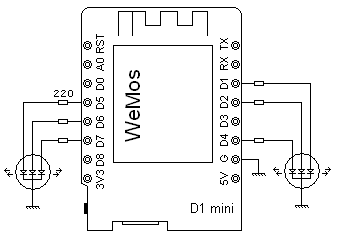
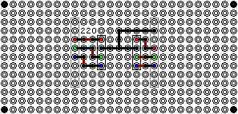

ESPNightLight
===============

ESP RGB Night Light.

Software:
---------

C++ source

Hardware:
---------

* http://www.thingiverse.com/thing:1273673 - Yoda Using The Force by MustangDave is licensed under the Creative Commons - Attribution - Non-Commercial license.
http://creativecommons.org/licenses/by-nc/3.0/

* Webmos D1 mini + wiring diagram of the interfaces:
 

* interface board:
  

* gallery:
       

